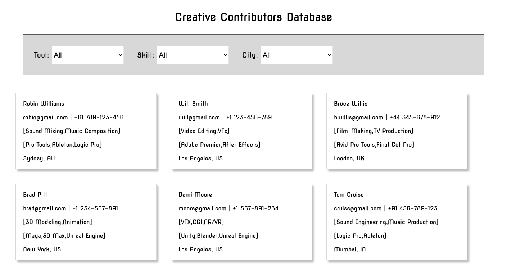

## 	REST APIs built in Python Flask to Access AWS Dynamo-DB Database

To start python flask web application, run 

	python3 dynamodb-api.py [PORT]

This will start the web service at http://localhost:5000 or http://localhost:PORT

Internally, dynamodb-api.py uses AWS SDK boto3 to fetch data from Dynamo-DB table.

Front-end is built in HTML + CSS + Javascript and internally, calls the REST APIs 
to access the database. These HTML web-pages can be found under /templates

### Python Scripts under directory /python :

To initialize the database using JSON file, run

	python3 load-data.py [JSON]

Sample JSON data-file is provided under JSON/dummy.json

To add new record to database, run

	python3 add-item.py [JSON]

Sample JSON file to add new entry can be found under JSON/item.json
